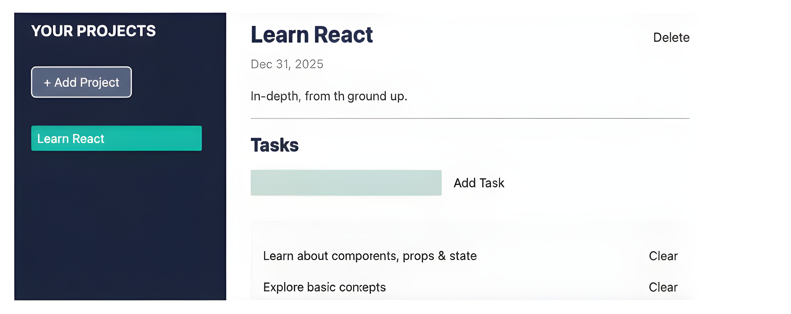

# **What Are Components**?

A key concept of React is the use of **components**.
Components are **reusable building blocks** that together compose the final **User Interface (UI)**.

👉 **Example:**
A simple website could be built from:

* **Sidebar** — containing navigation items
* **Main Section** — containing elements for adding and viewing tasks

## 📘 **React — Components**

<div align="center">
  

*Figure 2.1: An example task management screen with sidebar and main area*
</div>


---

## 🔍 Example Breakdown

If you look at the example page above, you can identify different **components**.

### 🔹 Components visible in the UI:

* **Sidebar** and its **navigation items**
* **Main page area**
* **Header in the main area** (with title and due date)
* **Form** (for adding tasks)
* **Task list**

---

## 🔄 Reusability & Nesting

⚡ One of the most **powerful features** of React is:

* **Components can be reused** (the same component can be used in multiple places).
* **Components can be nested inside each other** — meaning one component can contain another.

👉 That’s what makes React and similar libraries **efficient and modular**.

---

# ❓**Why Components**?

No matter which web page you look at, they are always built from **building blocks**.
This isn’t something unique to React.

👉 Even plain **HTML** already “thinks” in components if you take a closer look.
For example, you have elements like:

* ``
* `<header>`
* `<nav>`

And you combine these elements to **describe and structure** your website content.

---

## 🔧 Why React Embraces Components

React builds on this idea of breaking a web page into **reusable building blocks** because:

* It allows developers to work on **small, manageable chunks of code**.
* It’s much **easier and more maintainable** than working on a single, huge HTML (or React) file.

That’s why other libraries also embrace this approach:

* **Frontend libraries** like React or Angular
* **Backend templating engines** like **EJS** (Embedded JavaScript templates)

> 📝 **Note**
> EJS is a popular templating engine for JavaScript. It’s widely used in backend web development with **Node.js**.

---

## 🧩 Why Small Components Matter in React

When working with React, it’s especially important to keep your code **manageable** and **modular**.

Unlike plain HTML, React components are not just collections of HTML code.
Each component can also include:

* **JavaScript logic** 🧠
* **CSS styling** 🎨
* **JSX markup** 📄

👉 For complex UIs, combining markup, logic, and styling in a single file would quickly lead to **huge, unmaintainable code blocks**.
Think of a **large HTML file** that also contains **JavaScript and CSS** all mixed together — not very fun to work with!

---

## 🔑 Key Takeaway

When working on a React project:

* You will split your code into **many small components**.
* These components are then combined to form the overall **user interface**.
* This modular structure is a **core feature of React**.

> 📝 **Note**
> Technically, components are **optional** in React.
> You *could* build a large and complex web page using just **one single component**.
> But that would be **impractical** and **hard to maintain** — so it’s not recommended.

---

✨ That’s why **React projects rely heavily on components** — they make code clean, modular, and developer-friendly.

---

# ⚛️ **The Anatomy of a Component**

**Components** are the **building blocks** of any React application. They are essential for structuring your user interface. But what exactly does a React component look like? And how do you write them yourself? Let's dive in\! 🔎

-----

## 🚀 Example Component: `SubmitButton`

Here is an example of a simple component named `SubmitButton`:

### 📋 Code Snippet

```jsx
import { useState } from 'react';

function SubmitButton() {
  const [isSubmitted, setIsSubmitted] = useState(false);

  function handleSubmit() {
    setIsSubmitted(true);
  };

  return (
    <button onClick={handleSubmit}>
      { isSubmitted ? 'Loading…' : 'Submit' }
    </button>
  );
};

export default SubmitButton;
```

### ✨ Detailed Code Explanation

This code defines a functional React component named `SubmitButton`.

1.  **`import { useState } from 'react';`**:

      * This is a **standard JavaScript import statement**.
      * It imports the **`useState` Hook** from the React library. The `useState` Hook allows the component to manage **state** (data that changes over time) within the component.

2.  **`function SubmitButton() { ... }`**:

      * This is the definition of the component. A React component is typically defined as a **JavaScript function**. The name of the component, `SubmitButton`, must start with an **uppercase letter**.

3.  **`const [isSubmitted, setIsSubmitted] = useState(false);`**:

      * This line uses the `useState` Hook to initialize a piece of state.
      * **`isSubmitted`** is the current state value (a boolean, starting at `false`).
      * **`setIsSubmitted`** is the function used to update the state value.
      * The component starts in the state where the button **has not been submitted** (`false`).

4.  **`function handleSubmit() { setIsSubmitted(true); };`**:

      * This function is an **event handler**. It is executed when a specific event occurs (in this case, a click).
      * When called, it uses `setIsSubmitted(true)` to change the state variable `isSubmitted` to `true`. This action will cause the component to **re-render** (update on the screen).

5.  **`return ( ... );`**:

      * The `return` statement specifies what the component **renders** to the screen.
      * The content inside the `return` is **JSX** (JavaScript XML), which looks like HTML but allows you to mix in JavaScript logic.

6.  **`<button onClick={handleSubmit}>`**:

      * This creates a standard HTML **`<button>`** element.
      * `onClick={handleSubmit}` is an **event listener**. It tells React to run the `handleSubmit` function whenever the button is clicked.

7.  **`{ isSubmitted ? 'Loading…' : 'Submit' }`**:

      * This is **JavaScript logic embedded within the JSX** (using curly braces `{}`).
      * It uses a **ternary operator** to decide the button's text:
          * If `isSubmitted` is **`true`**, the text is `'Loading…'`.
          * If `isSubmitted` is **`false`**, the text is `'Submit'`.

8.  **`export default SubmitButton;`**:

      * This is a **standard JavaScript export statement**.
      * `export default` makes the `SubmitButton` component available for **importing** and use in other files.

-----

## 📁 Storing and Using the Component

### 💾 File Structure and Naming

  * You would typically store this code snippet in a **separate file**.
  * A common location is inside a dedicated folder, like `/src/components/SubmitButton.jsx`.
  * The file uses the **`.jsx` extension** because it contains **JSX code**.

> **⚠️ Vite Note:** The **Vite** development tool is strict and **enforces** the use of the `.jsx` file extension for files containing JSX code. Storing such code in a `.js` file is **not allowed** in Vite projects, although it might work in other React setups.

### 🖼️ Example of Component Usage

The following component, `AuthForm`, shows how to **import** and **use** the `SubmitButton` component:

### 📋 Code Snippet

```jsx
import SubmitButton from './submit-button.jsx';

function AuthForm() {
  return (
    <form>
      <input type="text" />
      <SubmitButton />
    </form>
  );
};

export default AuthForm;
```

### ✨ Detailed Code Explanation

1.  **`import SubmitButton from './submit-button.jsx';`**:

      * This imports the `SubmitButton` component (which was exported using `export default`) from its file location (`./submit-button.jsx`). The path is relative to the current file.

2.  **`function AuthForm() { ... }`**:

      * This defines a new component named `AuthForm`.

3.  **`<SubmitButton />`**:

      * This is where the magic happens\! This line **uses** the imported `SubmitButton` component inside the `AuthForm`'s return statement.
      * React will take the structure and logic defined in `SubmitButton` and insert it here, essentially rendering the interactive button as part of the form.

-----

## 📦 Understanding Imports and Exports

The `import` and `export` statements are not specific to React; they are **standard JavaScript keywords** that are fundamental to modern web development.

  * **Goal:** They help you **split related code across multiple files** (creating **modules**), making your project organized and maintainable.
  * **`export` or `export default`**: These keywords are used to make things like **variables, constants, classes, or functions** available from one file.
  * **`import`**: This keyword is used in another file to **bring in** the exported item so you can use it.

### 💡 Import Rules

  * **Local Components (Your Files):** You use the full file path. While Vite might technically allow you to omit the file extension (e.g., just `'./submit-button'`), it is generally a **good idea to include the extension (`.jsx`)** to align with standard JavaScript module practices.
  * **Third-Party Packages (e.g., React):** When importing from a package (like `useState` from the `react` package), you **do not add a file extension**. You simply use the package name.

-----

## 📚 Further Learning (Note)

If the idea of splitting code into separate files using `import` and `export` is new to you, it is highly recommended that you first explore **basic JavaScript resources on Modules**. Understanding this concept is crucial for working with any larger JavaScript project, including React.

🔗 [A great resource to learn the fundamentals is the MDN Web Docs article on Modules](https://developer.mozilla.org/en-US/docs/Web/JavaScript/Guide/Modules)


# 🏗️ **Component Foundations and Types**

The previous examples showed simplified components. While they include features like `useState()` that you haven't learned yet, the fundamental concept should be clear: React is built on **standalone building blocks** that can be easily **combined** to create a user interface. 🧱

---

## 🔁 Two Ways to Define Components

When working with React, there are two primary ways you can define a component:

1.  **Class-based components (or "class components")**:
    * Components defined using the **`class` keyword**.
2.  **Functional components (or "function components")**:
    * Components defined using **regular JavaScript functions**.

React requires that components are defined as either a **function** or a **class**. Throughout this section, components will be built as **JavaScript functions**. 💻

### 💡 Note on Component Types

* Until late 2018, developers **had to use class-based components** for tasks involving internal **state** (data that changes).
* In late 2018, **React Hooks** were introduced. This new concept allows you to perform **all operations and tasks** (including using state) with **functional components**.
* As a result, while **class-based components are still supported**, they are becoming less common and are generally being phased out in modern React development. Therefore, they will **not be covered** in this resource. 🙅

---

## 🔎 Noteworthy Component Features

Looking closely at the examples, several key characteristics define how components and their code are structured:

1.  **Capitalized Names**:
    * The main component functions must use **capitalized names** (e.g., `SubmitButton`). This is a convention that helps React distinguish components from regular HTML elements (which use lowercase names, like `<div>`). 🏷️

2.  **Inner Functions**:
    * Inside the component function, you can define other **"inner" functions** (e.g., `handleSubmit`). These are typically written in **`camelCase`** (starting with a lowercase letter) following standard JavaScript naming conventions.

3.  **HTML-like Return Code (JSX)**:
    * The component function must **return HTML-like code** (known as **JSX code**). This is how React knows what to render on the screen. 🖼️

4.  **Use of Features (Hooks)**:
    * Features like **`useState()`** (known as **Hooks**) can be used **inside** the component functions to add special capabilities, like managing state. 🎣

5.  **Exporting Components**:
    * The component functions must be **exported** (usually via `export default`) so they can be used in other parts of the application. 📤

6.  **Importing Features**:
    * Certain features (like `useState` from the `react` package) and other custom components (like `SubmitButton`) must be **imported** using the **`import` keyword** before they can be used. 📥

---


# ⚙️ **What Exactly Are Component Functions**?

In React, the main type of component is a **function component** (or **functional component**). This is a crucial concept to understand.

## 💡 Functions are JavaScript, Not React

A **function** is a **regular JavaScript construct**. It is **not** a concept invented by React. This is key because **React is a JavaScript library** and leverages existing JavaScript features (like functions) rather than being a brand-new programming language.

  * In React, regular JavaScript functions are used to **encapsulate** two things:
    1.  **HTML-like code** (specifically, **JSX**).
    2.  The **JavaScript logic** that belongs to that markup code.

## 🎯 What Qualifies a Function as a React Component?

Not every JavaScript function you write in a React project is a component.

### ❌ Non-Component Functions

Functions like the following example are just regular JavaScript utility functions and **do not qualify** as React components:

### 📋 Code Snippet

```javascript
function calculate(a, b) {
 return {sum: a + b};
};
```

  * The `handleSubmit` function from the earlier `SubmitButton` example is also a regular JavaScript function, but it is **not** a React component itself. It is an **inner function** or **event handler**.

### ✅ Component Functions

A function will be treated as a component by React and can therefore be used like an HTML element in JSX code **only if** it returns a **renderable value**.

  * **The Most Important Rule:** You can only use a function as a React component in JSX code if it is a function that **returns something that can be rendered by React**.
  * In the previous examples, `SubmitButton` and `AuthForm` qualified as components because they both **returned JSX code**, which is a renderable value.

Once a function qualifies as a React component, you can use it inside of JSX code just like an HTML element (e.g., `<SubmitButton />`), similar to how you use a built-in HTML element (like `<input />`).

-----

## 📞 How Components are Executed

When working with vanilla JavaScript, you typically **call functions yourself** to execute them (e.g., `calculate(5, 3)`).

With functional components, the process is different:

  * **React calls these functions on your behalf.**
  * As a developer, you simply **use them like HTML elements** inside the JSX code. This tells React, "Please render the output of this function here."

-----

## 🎨 Note on Renderable Values

The concept of a "renderable value" is important because it defines what a component is allowed to show on the screen.

While the most common and logical value type to return is indeed **JSX code** (because it allows you to define the structure and content of your user interface), there are a few other types of values that also qualify as renderable:

  * **JSX Code (Markup)**: The most frequent return value.
  * **Strings**: Plain text.
  * **Numbers**: Numerical values.
  * **Arrays**: An array can hold other renderable values, such as **JSX elements, strings, or numbers**.

*You will see examples of components returning non-JSX code in later lessons (for instance, in later section, covering Portals and Refs).*

---

# 🌐 **What Does React Do with All These Components**?

React's primary job is to **take your component structure** (a tree of components) and **translate it** into the low-level instructions the browser needs to display a user interface (**DOM manipulations**).

## 🚀 The React Entry Point

Every React application starts at a single main entry file, typically named **`main.jsx`** (found in the `src/` folder). This file contains the instructions that tell React where to start rendering the app.

### 📋 Code Snippet

```jsx
import React from 'react';
import ReactDOM from 'react-dom/client';
import './index.css';
import App from './App.jsx';

const root = ReactDOM.createRoot(document.getElementById('root'));

root.render(<App />);
```

### ✨ Detailed Code Explanation

1.  **Imports**:

      * **`import React from 'react';`**: Imports the core React library.
      * **`import ReactDOM from 'react-dom/client';`**: Imports the **`react-dom`** package, which provides the **"bridge"** needed to work with the browser's Document Object Model (DOM).
      * **`import App from './App.jsx';`**: Imports the **Root Component** of the entire application, usually named `App`.

2.  **`const root = ReactDOM.createRoot(document.getElementById('root'));`**:

      * **`ReactDOM.createRoot()`**: This method instructs React to **create a new entry point** for rendering.
      * **`document.getElementById('root')`**: The argument passed is a reference to a specific **existing HTML element** in the main `index.html` file (the single page served to visitors). React will use this element as the container to **inject** the entire user interface.

3.  **`root.render(<App />);`**:

      * **`root.render()`**: This method tells React **which content** (i.e., which component) should be rendered and injected into the root entry point.
      * **`<App />`**: This is the **Root Component** of the app. By passing it here, you are telling React to execute the `App` component function and start building the UI from there.

## 🌳 The Component Tree

The component passed to `root.render()` (usually `<App />`) is called the **Root Component**. All other components in the application are **nested** inside the JSX code of this `App` component or its descendant components.


---

<div align="center">
  
</div>

### Figure 2.2: Nested React components form a component tree

This figure illustrates how all components in a React application connect to form a **tree structure**:

**Step 1: The Root**

  * The entire application starts with the **`App`** component at the top. This is the component passed to `root.render()`.

**Step 2: Top-Level Children**

  * The `App` component's JSX code uses three child components: **`Header`**, **`Products`**, and **`Footer`**. These components are the main sections of the user interface.

**Step 3: Deeply Nested Components**

  * The **`Products`** component further contains its own children. In this example, it uses five components: **`Cart`**, and **three separate instances** of the **`Product`** component (the individual product cards/listings).

**Idea Explanation:**
React traverses this entire tree, starting from the root, diving into each component function, and executing it. The final output is not just one component, but the combined, fully nested structure of all components.

-----

## 🔄 Translating Components to DOM Instructions

The entire process of React working with components can be summarized by this core action: **React executes the component functions for you and translates the returned JSX code into DOM instructions.**

### Example Traversal and Translation

Consider these simplified component functions:

### 📋 Code Snippet

```jsx
function Greeting() {
 return <p>Welcome to this book!</p>;
};

function App() {
 return (
  <div>
    <h1>Hello World!</h1>
    <Greeting />
  </div>
 );
};

const root = ReactDOM.createRoot(document.getElementById('root'));
root.render(<App />);
```

**Steps React Performs:**

1.  **React executes `root.render(<App />)`**.
2.  **React executes the `App` component function**. It returns JSX containing `<div>`, `<h1>`, and the custom component `<Greeting />`.
3.  **React encounters the custom component `<Greeting />`** and **executes the `Greeting` function**. This function returns `<p>Welcome to this book!</p>`.
4.  **React replaces the custom component with its returned JSX**. Internally, the final, fully "resolved" structure looks like this:
    ```jsx
    <div>
        <h1>Hello World!</h1>
        <p>Welcome to this book!</p>
    </div>
    ```
5.  **React generates DOM Operations** from this resolved JSX structure.

**Final DOM Operations (The Steps):**

1.  **Create a `<div>` element.**
2.  **Inside that `<div>`, create two child elements:** `<h1>` and `<p>`.
3.  **Set the text content** of the `<h1>` element to 'Hello World\!'.
4.  **Set the text content** of the `<p>` element to 'Welcome to this book\!'.
5.  **Insert the entire `<div>`** (with its children) into the existing HTML element that has the ID 'root'.

By following this traversal and translation process, React successfully renders the complex component tree onto the actual web page.


---