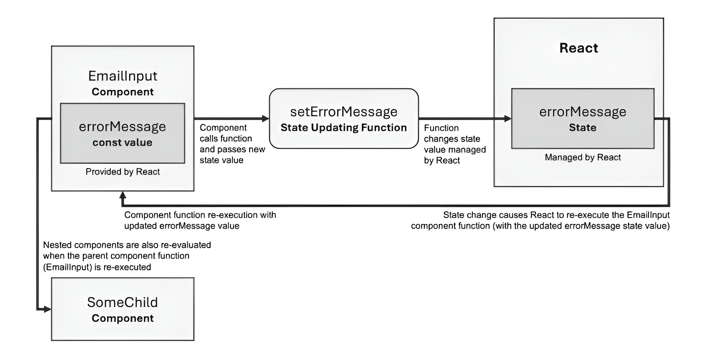

# ✨ **Working with Events and State in React**

**State**, is a fundamental React feature that empowers developers to manage internal component data. By adjusting this data, you can trigger updates to the User Interface (UI). We will also delve into handling user events, such as button clicks or text input, to create dynamic and interactive applications.

---

## 🎯 The Challenge: Static User Interfaces

Currently, any React application we build has a significant limitation: it's **static**. The UI is fixed and cannot change in response to user actions.

To better understand this issue, let's examine a typical React component.

### Example: A Static Email Input

Consider the following `EmailInput` component:

```javascript
function EmailInput() {
  return (
    <div>
      <input placeholder="Your email" type="email" />
      <p>The entered email address is invalid.</p>
    </div>
  );
};
```

#### Code Explanation

  * **`function EmailInput() { ... }`**: This defines a standard React functional component named `EmailInput`.
  * **`return ( ... );`**: The component returns JSX, which describes the UI structure.
  * **`<div>`**: A container element.
  * **`<input placeholder="Your email" type="email" />`**: An HTML input field designed for email addresses.
  * **`<p>The entered email address is invalid.</p>`**: A paragraph element that displays an error message.

You might wonder why the error message is permanently displayed. The goal is to show this paragraph *only* when the user has entered an invalid email. Ideally, the application should:

1.  Wait for the user to type in the input field.
2.  Evaluate the input after the user is finished (e.g., when the input field loses focus).
3.  Display the error message only if the email is invalid (e.g., it's empty or missing an `@` symbol).

With our current knowledge, this dynamic behavior is impossible to implement. The error message is always visible because there's no mechanism to change the UI based on user events or changing conditions. In short, the application is **static**, not **dynamic**. This is the core problem we aim to solve.

-----

## ❌ An Incorrect Approach: Direct DOM Manipulation

How might we attempt to make the `EmailInput` component dynamic? One might consider a traditional JavaScript approach.

**Spoiler Alert:** The following code will **not work** as intended in a React component file and is presented here as an example of what *not* to do.

```javascript
function EmailInput() {
  return (
    <div>
      <input placeholder="Your email" type="email" />
      <p></p>
    </div>
  );
};

// --- This part is the incorrect approach ---
const input = document.querySelector('input');
const errorParagraph = document.querySelector('p');

function evaluateEmail(event) {
  const enteredEmail = event.target.value;
  if (enteredEmail.trim() === '' || !enteredEmail.includes('@')) {
    errorParagraph.textContent = ' The entered email address is invalid.';
  } else {
    errorParagraph.textContent = '';
  }
};

input.addEventListener('blur', evaluateEmail);
```

### Code Explanation

This approach attempts to use standard browser APIs to manipulate the DOM elements rendered by React.

  * **`const input = document.querySelector('input');`**: This line uses the browser's DOM API to select the first `<input>` element on the page.
  * **`const errorParagraph = document.querySelector('p');`**: Similarly, this selects the first `<p>` element.
  * **`function evaluateEmail(event) { ... }`**: This function is designed to handle the validation logic.
      * **`const enteredEmail = event.target.value;`**: It extracts the current value from the input field that triggered the event.
      * **`if (enteredEmail.trim() === '' || !enteredEmail.includes('@'))`**: This condition checks if the email is empty (after trimming whitespace) or does not contain an `@` symbol.
      * **`errorParagraph.textContent = '...';`**: If the email is invalid, it directly sets the text content of the paragraph to show the error message.
      * **`else { errorParagraph.textContent = ''; }`**: If the email is valid, it clears the paragraph's text content, hiding the message.
  * **`input.addEventListener('blur', evaluateEmail);`**: This attaches an event listener to the input field. The `evaluateEmail` function will be executed whenever the `blur` event occurs (i.e., when the user clicks away from the input field).

This code fails because you cannot reliably select React-rendered DOM elements in this manner from within the same component file. While you might find a workaround (like placing the code in a `setTimeout` callback) to make it execute after React renders the elements, it fundamentally goes against the principles of React.

-----

## 🧠 Imperative vs. Declarative: The React Philosophy

Even if the direct manipulation code could be made to work, it represents a flawed strategy. Here's why:

> It’s **imperative code**\! This means you are writing step-by-step instructions on what the browser should do. You are not declaring the desired end state; you are instead describing a specific path to get there, and this path does not involve React.

React's core philosophy is to be **declarative**. You describe the final UI state you want, and you let React manage the complex, step-by-step DOM manipulations required to achieve it.

By writing imperative code, you are working **against** React, not with it. This isn't just a philosophical disagreement; it creates tangible problems:

  * **Increased Complexity**: You are forced to manually solve problems that React is designed to handle automatically. This leads to more code and more effort.
  * **Missed Optimizations**: You bypass React's internal reconciliation algorithm, potentially missing out on performance optimizations that React provides under the hood.
  * **Bugs and Poor Performance**: Your manual solution is more likely to be buggy and less performant than React's optimized approach.
  * **Maintenance Nightmare**: The `EmailInput` example is simple. Imagine building a complex application like an online store, a vacation rental site, or Google Docs. Managing hundreds of dynamic UI elements by mixing React with vanilla JavaScript would quickly become unmanageable.

In essence, by avoiding the tools React provides, you make your job as a developer harder and compromise the quality of your application. The benefits of using a declarative library like React are lost when you revert to imperative DOM manipulation. To fully grasp these advantages, it's helpful to understand React's foundational concepts of components and JSX.


---

# 💡 **A Better, Yet Flawed, Solution**

The previous naive approach presents significant challenges. It requires complex workarounds, like using `setTimeout()` to delay code execution, and results in logic being scattered across component functions, external scopes, and potentially unrelated files.

Let's explore an improved solution that attempts to embrace React's component-centric model.

-----

### The Proposed Code

This version contains all the logic within the component itself.

```javascript
function EmailInput() {
  let errorMessage = '';

  function evaluateEmail(event) {
    const enteredEmail = event.target.value;
    if (enteredEmail.trim() === '' || !enteredEmail.includes('@')) {
      errorMessage = 'The entered email address is invalid.';
    } else {
      errorMessage = '';
    }
  };

  const input = document.querySelector('input');
  input.addEventListener('blur', evaluateEmail);

  return (
    <div>
      <input placeholder="Your email" type="email" />
      <p>{errorMessage}</p>
    </div>
  );
};
```

#### Code Explanation

  * **`let errorMessage = '';`**: A local variable `errorMessage` is declared and initialized as an empty string. This variable is intended to hold the validation message.
  * **`function evaluateEmail(event) { ... }`**: This is the same validation function as before. However, instead of directly manipulating a DOM element's text, it updates the `errorMessage` variable.
  * **`const input = document.querySelector('input');`**: This line again attempts to select the `<input>` element from the DOM.
  * **`input.addEventListener('blur', evaluateEmail);`**: This attaches the `blur` event listener to the selected input, aiming to trigger the `evaluateEmail` function.
  * **`<p>{errorMessage}</p>`**: In the JSX, the `errorMessage` variable is rendered inside the paragraph tags. The goal is for React to display the current value of this variable in the UI.

-----

### ✅ What This Approach Gets Right

Although this code is also non-functional, it is a significant step in the right direction. It more closely follows the React philosophy for two key reasons:

1.  **Encapsulation**: All the logic—the variable holding the message, the validation function, and the event handling—is contained entirely within the `EmailInput` component function to which it belongs.
2.  **Declarative UI**: The error message is managed via the `errorMessage` variable, which is directly included in the JSX (`<p>{errorMessage}</p>`). This is a more declarative pattern where the UI "declares" that it should display whatever is in that variable.

> The core idea behind this improved solution is correct: **the React component that controls a UI element should also be responsible for its state and events.**

-----

### ❌ The Two Critical Flaws

Despite its better structure, this approach is still destined to fail for two fundamental reasons:

1.  **DOM Selection Fails**: The code `document.querySelector('input')` executes when the `EmailInput` function is first called by React. At this point, the JSX has not yet been rendered to the actual browser DOM. Therefore, `document.querySelector` finds no `<input>` element, and the code crashes. Attempting to delay this code would mean we are once again fighting against React's rendering lifecycle.
2.  **The UI Will Not Update**: Even if we could successfully select the input element, there is a more critical issue. Changing the value of a standard JavaScript variable like `errorMessage` **does not trigger React to re-render the component**. React has no way of knowing that this variable has changed and that the UI needs to be updated to reflect its new value.

To create a working, dynamic component, we must solve these two problems. The correct implementation will fully embrace React's features, avoiding any mix of React and non-React code for DOM manipulation and state management. The result will be simpler, cleaner, and more efficient code.

---

# 🚀 **Improving the Solution: Handling Events the React Way**

Instead of mixing imperative JavaScript code (like `document.querySelector('input')`) with your React code, the best approach is to fully embrace the features React provides. Listening to events is an extremely common task, and React has a powerful, built-in solution for it: attaching event listeners directly to your JSX elements.

-----

## ✅ The Correct Way to Listen to Events

By using React's event system, the previous example can be rewritten to handle events correctly.

```javascript
function EmailInput() {
  let errorMessage = '';

  function evaluateEmail(event) {
    const enteredEmail = event.target.value;
    if (enteredEmail.trim() === '' || !enteredEmail.includes('@')) {
      errorMessage = 'The entered email address is invalid.';
    } else {
      errorMessage = '';
    }
  };

  return (
    <div>
      <input 
        placeholder="Your email" 
        type="email" 
        onBlur={evaluateEmail} 
      />
      <p>{errorMessage}</p>
    </div>
  );
};
```

#### Code Explanation

While this code **still won't update the UI dynamically**, the event is now handled properly without causing errors.

  * **`onBlur={evaluateEmail}`**: This is the key change. The `onBlur` prop is added directly to the `<input>` JSX element. This is React's built-in way to listen for the "blur" event (when an element loses focus). Its value is set to `{evaluateEmail}`, which points to our validation function.

-----

## 💡 Understanding Event Props

React provides components for all standard HTML elements (like `<div>`, `<input>`, `<p>`, etc.). These components come with props that correspond to standard HTML attributes, plus some special ones for handling events.

> React exposes all standard DOM events as `onXYZ` props, where `XYZ` is the name of the event with the first letter capitalized.

For example:

  * To react to a `blur` event, you use the **`onBlur`** prop.
  * To listen for a `click` event, you use the **`onClick`** prop.

These event props require a **function** as their value. This function will be automatically executed by React whenever the corresponding event occurs on that element. In our example, the `onBlur` prop receives a pointer to the `evaluateEmail` function.

### A Quick Note on Functions: Reference vs. Execution

It is crucial to understand the difference between passing a function reference and executing a function.

  * `evaluateEmail`: This is a **pointer** or **reference** to the function itself. We are telling React, "Here is the function to execute later when the event happens." This is the correct way to assign an event handler.
  * `evaluateEmail()`: This **executes** the function immediately and assigns its return value (if any) to the prop. This is incorrect for event handlers, as it would run the function during rendering, not when the event occurs.

This is a standard JavaScript concept. For a more detailed explanation, you can refer to the [MDN Web Docs on Events](https://www.google.com/search?q=https://developer.mozilla.org/en-US/docs/Web/Events%23event_listing).

-----

## 🔍 Verifying the Event Handler

With the `onBlur` prop correctly implemented, our code now executes without any errors. You can verify that the event handler is working by adding a `console.log()` statement inside the `evaluateEmail` function.

```javascript
function EmailInput() {
  let errorMessage = '';

  function evaluateEmail(event) {
    console.log('Hello'); // This will now work!
    const enteredEmail = event.target.value;
    if (enteredEmail.trim() === '' || !enteredEmail.includes('@')) {
      errorMessage = 'The entered email address is invalid.';
    } else {
      errorMessage = '';
    }
  };

  return (
    <div>
      <input 
        placeholder="Your email" 
        type="email" 
        onBlur={evaluateEmail} 
      />
      <p>{errorMessage}</p>
    </div>
  );
};
```

Now, when you type in the input field and then click away (triggering the blur event), the text `'Hello'` will appear in your browser's developer console.

-----

## 🚧 The Lingering Problem: A Static UI

This is a significant step toward the final solution. The event handling is now clean, error-free, and follows React best practices. However, the main goal has not yet been achieved: the UI still does not update dynamically when the `errorMessage` variable changes.

---

# 🎉 **The Solution: Updating State Correctly**

You now understand how to set up event listeners and execute functions in response to user actions. The final missing piece is a way to force React to update the visible UI on the screen whenever our data changes.

This is precisely where React's **state** concept comes into play.

-----

## 🧩 Introducing React State

Like props, **state** is a core concept in React. However, they serve different purposes:

  * **Props** are used to pass **external data** *into* a component.
  * **State** is used to manage and update **internal data** *within* a component.

Most importantly, whenever a component's state is updated, React automatically re-renders the parts of the UI that are affected by that change. This is the key to creating dynamic and interactive applications.

-----

## The Complete, Working Code

Here is how state is used to solve our email validation problem. The code will be explained in detail below.

```javascript
import { useState } from 'react';

function EmailInput() {
  const [errorMessage, setErrorMessage] = useState('');

  function evaluateEmail(event) {
    const enteredEmail = event.target.value;
    if (enteredEmail.trim() === '' || !enteredEmail.includes('@')) {
      setErrorMessage('The entered email address is invalid.');
    } else {
      setErrorMessage('');
    }
  };

  return (
    <div>
      <input
        placeholder="Your email"
        type="email"
        onBlur={evaluateEmail} 
      />
      <p>{errorMessage}</p>
    </div>
  );
};
```

This code looks very similar to our previous attempts, but it contains one critical difference: the use of the **`useState()` Hook**.

-----

## ⚙️ Deconstructing the `useState` Hook

**Hooks** are another fundamental concept in React. They are special functions that let you "hook into" React features from your functional components.

The **`useState()`** Hook is an extremely common and important Hook that allows a component to hold and manage data that changes over time.

Let's break down how it works in our example:

1.  **`import { useState } from 'react';`**

      * First, we must import the `useState` Hook from the `react` library to make it available in our component file.

2.  **`const [errorMessage, setErrorMessage] = useState('');`**

      * We call `useState()` inside our component. `useState` is a function that returns an array containing exactly two elements.
      * We use a JavaScript feature called "array destructuring" to assign names to these two elements.
      * **`errorMessage`**: This is our **state variable**. It holds the current value of our state. The value we pass to `useState('')` is the initial value for this variable. So, `errorMessage` starts as an empty string.
      * **`setErrorMessage`**: This is our **state updating function**. This is the *only* function you should use to change the value of `errorMessage`. When you call this function with a new value, you are telling React that the state has changed.

3.  **`setErrorMessage('...');`**

      * Inside our `evaluateEmail` function, instead of trying to change a regular variable, we now call the `setErrorMessage` function.
      * When the email is invalid, we call `setErrorMessage('The entered email address is invalid.')`.
      * When the email is valid, we call `setErrorMessage('')`.
      * Calling this function signals to React that the `EmailInput` component's state has been updated. React will then automatically re-run the component function and update the UI to display the new `errorMessage` value.

-----

## 🧠 The Core Idea of State and Hooks

The primary purpose of the `useState` Hook is to manage data inside a component in a way that, when updated, tells React to update the UI accordingly.

> **State is data which, when changed, forces React to re-evaluate a component and update the UI if needed.**

Using Hooks like `useState` is straightforward:

1.  **Import** them from `'react'`.
2.  **Call** them inside your component function to add a specific feature (like state management) to your component.

Hooks are special functions that can only be used inside React components (or other custom Hooks). React provides various built-in Hooks for different purposes, which you will encounter as you build more complex applications.


---

# 🔬 **A Deeper Look at the `useState` Hook**

Let's explore exactly how the `useState()` Hook functions and what it does internally to enable dynamic user interfaces in React.

-----

## How `useState` Works Internally

When you call `useState()` inside a component, you are effectively registering a piece of data with React. This is similar to defining a variable in plain JavaScript, but with a crucial difference: **React actively tracks this registered value**. Whenever you update this value using the provided function, React re-evaluates the component where the state was registered.

During this re-evaluation, React checks if the data change affects the UI.

  * If React determines that the UI needs to change (for instance, because the state value is displayed in the JSX), it efficiently updates the actual DOM only where necessary.
  * If no UI update is needed, the re-evaluation process concludes without any changes to the DOM.

This entire process begins when `useState()` is called within a component, which creates a state value tied to that specific component instance.

-----

## ⚙️ Dissecting the `useState` Syntax

You register an initial state value by passing it as an argument to the `useState()` function. In our previous examples, we used an empty string (`''`) as the starting value.

```javascript
const [errorMessage, setErrorMessage] = useState('');
```

The `useState()` function not only accepts an initial value but also returns a value: **an array containing exactly two elements**.

The syntax shown above uses **array destructuring**, a standard JavaScript feature that lets you unpack values from an array directly into constants or variables. Here, the two elements returned by `useState()` are immediately assigned to the constants `errorMessage` and `setErrorMessage`.

While this is the conventional approach, you are not required to use array destructuring. The following code is functionally identical:

```javascript
const stateData = useState('');
const errorMessage = stateData[0];
const setErrorMessage = stateData[1];
```

This alternative works perfectly fine, but array destructuring leads to more concise code, which is why it is the standard syntax you will see in most React applications.

The two elements returned by `useState()` always have the same role:

1.  **The first element** is the current state value.
2.  **The second element** is a function used to update that state value.

> 💡 **A Note on JavaScript Basics**
> If array destructuring or the difference between `let` (variables) and `const` (constants) is unfamiliar, it is highly recommended to review these fundamental JavaScript concepts. MDN provides excellent resources on [array destructuring](https://www.google.com/search?q=http://packt.link/3B8Ct), [let](https://packt.link/hGjqL), and [const](https://packt.link/TdPPS).

-----

## 🔧 A Look Under the Hood

React manages state values for you in an internal storage that you cannot access directly. To interact with this state, React provides a clear and controlled mechanism through the two-element array returned by `useState()`.

  * **Reading State**: Since you often need to access the current state value (e.g., to display it in the UI), React gives you the first element of the array. This element always holds the current state.
  * **Updating State**: To change the state, you must use the second element: the **state-updating function**. You cannot modify the state directly.

But why is this system necessary? Why not just use a standard JavaScript variable?

The reason is that **React needs to be informed when a state change occurs**. React does not monitor regular JavaScript variables. If you were to change a normal variable, React would be unaware, and the UI would never update. The state-updating function (`setErrorMessage` in our example) does more than just set a new value; it also notifies React that a state has changed, triggering the re-evaluation and potential UI update process.

The following diagram illustrates this entire flow:

<div align="center">
  
</div>

### Diagram Explanation

Here is a step-by-step breakdown of the flow shown in **Figure 4.2**:

1.  **Component State**: The `EmailInput` component has a state variable named `errorMessage`. This value is provided and managed internally by React.
2.  **Triggering an Update**: An event occurs (like a user typing), and the component calls the **state-updating function**, `setErrorMessage`, passing it a new value.
3.  **Informing React**: This function call signals to React that the `errorMessage` state needs to change. React updates the value it holds in its internal memory.
4.  **Scheduling a Re-Render**: Because the state has changed, React schedules a re-execution (or re-render) of the `EmailInput` component.
5.  **Component Re-execution**: React calls the `EmailInput` component function again. This time, when `useState` is encountered, React provides the **new, updated `errorMessage` value**.
6.  **Child Component Updates**: As the parent (`EmailInput`) re-executes, any nested components (like `SomeChild`) are also re-evaluated to ensure the entire UI is consistent.

This cycle explains how a `const` can appear to change. In reality, the component function is run again from scratch, and a *new* `const` is declared for that specific render, holding the latest state value provided by React.

---

## 🔄 The Component Re-Execution Cycle

It's essential to understand that when a state-updating function is called, **React re-executes the entire component function from the beginning**. This also applies to any child components nested within it.

This might seem confusing, especially since we declare the state variable with `const`, which cannot be reassigned. The key is that during the re-execution:

1.  The `useState()` hook is called again.
2.  React, which manages the state internally, returns a *new* array.
3.  The first element of this new array now contains the **updated state value**.

This process can be tricky to grasp initially, but it is the core of how React's state mechanism works. Your component is simply a function that React can call multiple times, each time with the latest state values.

-----

## 🏷️ Naming Conventions

When using `useState` with array destructuring, the names you choose are up to you. However, a clear and widely adopted convention exists.

```javascript
const [enteredEmail, setEnteredEmail] = useState('');
```

Typically, if the state variable is named `value`, the state-updating function is named `setValue`. This convention makes the code readable and easy to understand.

-----

## 📦 Allowed State Value Types

While managing user input (strings) is a common use case for state, you can manage any valid JavaScript value. This includes:

  * **Primitive Types**: Strings, numbers, and booleans.
  * **Reference Types**: Objects and arrays.

React is flexible, allowing you to manage all these data types as state. You can even change the type at runtime (e.g., updating a number to a string), although, as with standard JavaScript, you should ensure your code handles such behavior correctly.

> 💡 **Primitive vs. Reference Types**
> If the distinction between primitive and reference data types in JavaScript is not clear, it is strongly recommended to review this core concept. You can find a helpful guide [here](https://academind.com/tutorials/reference-vs-primitive-values).

---