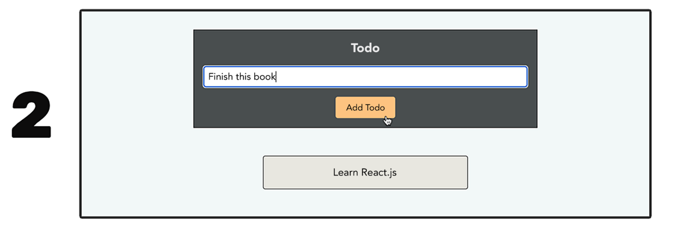

# 🚀 **Conditional Content and List Data**

<details open>
<summary>📋 Table of Contents</summary>

- [🚀 **Conditional Content and List Data**](#-conditional-content-and-list-data)
  - [❓ What is Conditional Content?](#-what-is-conditional-content)
  - [📜 What is List Data?](#-what-is-list-data)
- [💻 **Rendering Content Conditionally**](#-rendering-content-conditionally)
    - [Figure 5.1: Initial View](#figure-51-initial-view)
    - [Figure 5.2: View After Click](#figure-52-view-after-click)
    - [Initial (Non-Conditional) Code](#initial-non-conditional-code)
    - [Approach 1: Using Conditional Values (with a Flaw)](#approach-1-using-conditional-values-with-a-flaw)
      - [Code Explanation dissected](#code-explanation-dissected)
      - [⚠️ The Problem with This Approach](#️-the-problem-with-this-approach)
    - [Figure 5.3: An Empty Paragraph Element in the DOM](#figure-53-an-empty-paragraph-element-in-the-dom)
    - [Approach 2: Using Conditional Elements (The Correct Way)](#approach-2-using-conditional-elements-the-correct-way)
      - [Code Explanation dissected](#code-explanation-dissected-1)
      - [✅ The Result](#-the-result)
- [🚀 **Different Ways of Rendering Content Conditionally**](#-different-ways-of-rendering-content-conditionally)
  - [1. Utilizing Ternary Expressions](#1-utilizing-ternary-expressions)
    - [React Example with a Ternary Expression](#react-example-with-a-ternary-expression)
      - [Code Explanation dissected](#code-explanation-dissected-2)
    - [Disadvantage of Ternary Expressions](#disadvantage-of-ternary-expressions)
    - [Inlining Ternary Expressions in JSX](#inlining-ternary-expressions-in-jsx)
      - [Code Explanation dissected](#code-explanation-dissected-3)
  - [2. Abusing JavaScript Logical Operators](#2-abusing-javascript-logical-operators)
    - [The Problem](#the-problem)
    - [The Solution: Short-Circuiting](#the-solution-short-circuiting)
  - [3. Get Creative!](#3-get-creative)
      - [Code Explanation dissected](#code-explanation-dissected-4)
  - [4. 🤔 Which Approach is Best?](#4--which-approach-is-best)
  - [5. 🏷️ Setting Element Tags Conditionally](#5-️-setting-element-tags-conditionally)
      - [Code Explanation dissected](#code-explanation-dissected-5)
    - [Using Variables for Component Types](#using-variables-for-component-types)
- [📤 **Outputting List Data**](#-outputting-list-data)
      - [Code Explanation dissected](#code-explanation-dissected-6)
      - [Code Explanation dissected](#code-explanation-dissected-7)
      - [Code Explanation dissected](#code-explanation-dissected-8)
      - [Code Explanation dissected](#code-explanation-dissected-9)
  - [🗺️ Mapping List Data](#️-mapping-list-data)
      - [Code Explanation dissected](#code-explanation-dissected-10)
      - [Code Explanation dissected](#code-explanation-dissected-11)
      - [Code Explanation dissected](#code-explanation-dissected-12)
  - [🔄 Updating Lists](#-updating-lists)
    - [🚫 Incorrect Approach 1: Mutating State](#-incorrect-approach-1-mutating-state)
      - [Code Explanation dissected](#code-explanation-dissected-13)
    - [🚫 Incorrect Approach 2: Using Mutating Methods with `setTodos`](#-incorrect-approach-2-using-mutating-methods-with-settodos)
    - [✅ Correct Approach: Immutable Updates](#-correct-approach-immutable-updates)
      - [Code Explanation dissected](#code-explanation-dissected-14)
  - [🔑 A Problem with List Items: Missing "Keys"](#-a-problem-with-list-items-missing-keys)
    - [Figure 5.4: Missing Key Warning](#figure-54-missing-key-warning)
    - [Figure 5.5: Updating a List (Visual Flow)](#figure-55-updating-a-list-visual-flow)
    - [Figure 5.6: Inefficient DOM Update (Without Keys)](#figure-56-inefficient-dom-update-without-keys)
  - [🔑 Keys to the Rescue!](#-keys-to-the-rescue)
      - [Code Explanation dissected](#code-explanation-dissected-15)
    - [What Makes a Good Key?](#what-makes-a-good-key)
    - [What if I don't have an ID?](#what-if-i-dont-have-an-id)
    - [Figure 5.7: Efficient DOM Update (With Keys)](#figure-57-efficient-dom-update-with-keys)

</details>

---

Before exploring the techniques for outputting conditional content or list data, it is essential to first understand exactly what these terms mean.

---

## ❓ What is Conditional Content?

**Conditional content** simply refers to any type of content that should only be displayed under specific circumstances.

Here are a few examples:

* 🛑 **Error Overlays:** These should only appear if a user submits incorrect data in a form.
* 📋 **Additional Form Fields:** These might appear once a user chooses to enter extra details (such as business details).
* ⏳ **Loading Spinners:** This is displayed while data is being sent to or fetched from a backend server.
* 🍔 **Side Navigation Menus:** This menu slides into view only when the user clicks on a menu button.

This is just a very short list of examples. You could, of course, come up with hundreds of additional examples.

However, it should be clear what all these examples are about in the end: they are **visual elements** or entire sections of the user interface that are **only shown if certain conditions are met**.

> **Example Breakdown:** In the first example (an error overlay), the **condition** would be that a user entered incorrect data into a form. The **conditionally shown content** would then be the error overlay.

Conditional content is extremely common, since virtually all websites and web apps have some content that is similar or comparable to the preceding examples.

---

## 📜 What is List Data?

In addition to conditional content, many websites also output **lists of data**. It might not always be immediately obvious, but if you think about it, there is virtually no website that does not display some kind of list data.

Again, here are some examples of list data that may be outputted on a site:

* 🛍️ An online shop displaying a grid or list of products.
* 🗓️ An event booking site displaying a list of events.
* 🛒 A shopping cart displaying a list of cart items.
* 🧾 An orders page displaying a list of orders.
* ✍️ A blog displaying a list of blog posts—and maybe a list of comments below a blog post.
* 🧭 A list of navigation items in the header.

An endless list (no pun intended) of examples could be created here. Lists are everywhere on the web.

As the preceding examples show, many (probably even most) websites have multiple lists with various kinds of data on the same site.

> **Example Breakdown:** Take an online shop, for example. Here, you would have a list (or a grid, which is really just another kind of list) of products, a list of shopping cart items, a list of orders, a list of navigation items in the header, and certainly a lot of other lists as well.

This is why it is important that you know how to output any kind of list with any kind of data in React-driven user interfaces.

---

# 💻 **Rendering Content Conditionally**

Imagine the following scenario: You have a button that, when clicked, should result in the display of an extra text box, as shown here.

-----

### Figure 5.1: Initial View

<div align="center">
  

  <b>Figure 5.1: Initial View</b>
</div>

Initially, nothing but the button shows up on the screen.

<div align="center">
  

  <b>Figure 5.2: View After Click</b>
</div>

### Figure 5.2: View After Click

After a click on the button, another box is shown.

This is a very simple example, but it's not unrealistic. Many websites have parts of the user interface that work like this. Showing extra information upon a button click (or a similar interaction) is a common pattern. Just think of nutrition information below a meal on a food-ordering site or an FAQ section where answers are shown after selecting a question.

So, how could this scenario be implemented in a React app?

### Initial (Non-Conditional) Code

If you ignore the requirement of rendering some of the content conditionally, the overall React component could look like this:

```jsx
function TermsOfUse() {
 return (
  <section>
   <button>Show Terms of Use Summary</button>
   <p>
    By continuing, you accept that we will not indemnify you for any
    damage or harm caused by our products.
   </p>
  </section>
 );
}
```

This component has absolutely no conditional code in it. Therefore, both the button and the extra information box are shown all the time.

In this example, how could the paragraph with the terms-of-use summary text be shown conditionally (that is, only after the button is clicked)?

-----

### Approach 1: Using Conditional Values (with a Flaw)

With the knowledge gained throughout the previous Previous Section especially **Previous Section, Working with Events and State**, you already have the skills needed to only show the text after the button is clicked.

The following code shows how the component could be rewritten to show the full text only after the button is clicked:

```jsx
import { useState } from 'react';

function TermsOfUse() {
 const [showTerms, setShowTerms] = useState(false);
 
 function handleShowTermsSummary() {
  setShowTerms(true);
 }

 let paragraphText = '';

 if (showTerms) {
  paragraphText = 'By continuing, you accept that we will not indemnify you for any damage or harm caused by our products.';
 }

 return (
  <section>
   <button onClick={handleShowTermsSummary}>Show Terms of Use Summary</button>
   <p>{paragraphText}</p>
  </section>
 );
}
```

#### Code Explanation dissected

  * `import { useState } from 'react';`
      * This line imports the `useState` Hook from React, which allows us to add state to our functional component.
  * `const [showTerms, setShowTerms] = useState(false);`
      * We initialize a new state variable called `showTerms` with a default value of `false`.
      * `setShowTerms` is the function we will use to update this state.
  * `function handleShowTermsSummary() { ... }`
      * This function is an event handler. It will be called when the button is clicked.
      * Inside, it calls `setShowTerms(true)`, updating the state variable `showTerms` to `true`.
  * `let paragraphText = '';`
      * We declare a variable `paragraphText` and initialize it as an empty string.
  * `if (showTerms) { ... }`
      * This is our conditional logic. If the state variable `showTerms` is `true` (which it will be after the button click), the `paragraphText` variable is reassigned to the full terms-of-use summary.
  * `return ( ... )`
      * The component returns JSX.
      * The `<button>` now has an `onClick` prop that points to our `handleShowTermsSummary` handler.
      * The `<p>` element outputs the current value of the `{paragraphText}` variable. Initially, it's an empty string. After the click, it contains the full summary.

#### ⚠️ The Problem with This Approach

Parts of the code shown in this snippet already qualify as conditional content. The `paragraphText` value is set conditionally, with the help of an `if` statement based on the value stored in the `showTerms` state.

However, the `<p>` element itself is **actually not conditional**. It is always there, regardless of whether it contains a full sentence or an empty string. If you were to open the browser developer tools and inspect that area of the page, an empty paragraph element would be visible, as shown in the following figure.

<div align="center">
  

  <b>Figure 5.3: An Empty Paragraph Element in the DOM</b>
</div>

### Figure 5.3: An Empty Paragraph Element in the DOM

This image shows the browser's developer tools. On the left, a "Show Terms of Use Summary" button is visible. On the right, the HTML "Elements" tab shows the DOM structure. A `<p></p>` element is highlighted, existing in the DOM right after the `<button>`, even though it contains no text.

Having that empty `<p>` element in the DOM is not ideal. While it’s invisible to the user, it’s an extra element that needs to be rendered by the browser. The performance impact will very likely be negligible, but it’s still something you should avoid. A web page doesn’t benefit from having empty elements that contain no content.

### Approach 2: Using Conditional Elements (The Correct Way)

You can translate your knowledge about conditional values (such as the paragraph text) to **conditional elements**, however. Besides storing standard values (like text or numbers) in variables, **you can also store JSX elements in variables**.

This is possible because, as mentioned in **Previous Section, React – What and Why**, JSX is just syntactic sugar. Behind the scenes, a JSX element is a standard JavaScript function that is executed by React. Also, of course, the return value of a function call can be stored in a variable or constant.

With that in mind, the following code could be used to render the entire paragraph conditionally:

```jsx
import { useState } from 'react';

function TermsOfUse() {
 const [showTerms, setShowTerms] = useState(false);

 function handleShowTermsSummary() {
  setShowTerms(true);
 }

 let paragraph;

 if (showTerms) {
  paragraph = 
   <p>
    By continuing, you accept that we will not indemnify you for
    any damage or harm caused by our products.
   </p>;
 }

 return (
  <section>
   <button onClick={handleShowTermsSummary}>Show Terms of Use Summary</button>
   {paragraph}
  </section>
 );
}
```

#### Code Explanation dissected

  * `let paragraph;`
      * We declare a variable named `paragraph`. Notice it is not initialized with any value, so it is `undefined` by default.
  * `if (showTerms) { ... }`
      * This conditional block remains the same.
      * However, *inside* the `if` block, we are no longer assigning a string. We are assigning the **entire JSX `<p>...</p>` element** to the `paragraph` variable.
  * `return ( ... )`
      * In the returned JSX, we dynamically output the value stored in the `paragraph` variable using `{paragraph}`.

#### ✅ The Result

  * **If `showTerms` is `false`:** The `if` block is skipped. The `paragraph` variable remains `undefined`. Inserting `null` or `undefined` in JSX code leads to **nothing being outputted by React**. The DOM will not contain an empty `<p>` tag.
  * **If `showTerms` is `true`:** The `if` block executes. The `paragraph` variable holds the complete `<p>` element, which is then rendered and outputted in the DOM.

---

# 🚀 **Different Ways of Rendering Content Conditionally**

While using a variable set by an `if` statement is a common and perfectly fine technique for rendering content conditionally, it is not the only approach you can use.

Alternatively, you could also do the following:

  * 💡 Utilize **ternary expressions**.
  * ✨ "Abuse" **JavaScript logical operators**.
  * 🧩 Use any other valid JavaScript method for selecting values conditionally.

The following sections will explore each approach in detail.

-----

## 1. Utilizing Ternary Expressions

In JavaScript (and many other programming languages), you can use **ternary expressions** (also referred to as conditional ternary operators) as alternatives to `if` statements. Ternary expressions can save you lines of code, especially with simple conditions where the main goal is to assign a value to a variable conditionally.

Here is a direct comparison—first starting with a regular `if` statement:

```javascript
let a = 1;
if (someCondition) {
 a = 2;
}
```

Here is the same logic, implemented with a ternary expression:

```javascript
const a = someCondition ? 2 : 1;
```

This is standard JavaScript code, not specific to React. However, it is important to understand this core JavaScript feature to understand how it can be used in React apps.

### React Example with a Ternary Expression

Translated to the previous React example, the paragraph content could be set and outputted conditionally with the help of a ternary expression like this:

```jsx
import { useState } from 'react';

function TermsOfUse() {
 const [showTerms, setShowTerms] = useState(false);

 function handleShowTermsSummary() {
  setShowTerms(true);
 }

 const paragraph = showTerms ? <p>By continuing, you accept that we will not
indemnify you for any damage or harm caused by our products.</p> : null;

 return (
  <section>
   <button onClick={handleShowTermsSummary}>Show Terms of Use Summary</button>
   {paragraph}
  </section>
 );
}
```

#### Code Explanation dissected

  * `const paragraph = showTerms ? ... : null;`
      * This is the ternary expression.
      * It checks the value of `showTerms`.
      * **If `showTerms` is `true`:** The `paragraph` constant is assigned the JSX `<p>...</p>` element.
      * **If `showTerms` is `false`:** The `paragraph` constant is assigned `null`.
  * `{paragraph}`
      * This outputs the value of the `paragraph` constant. `null` is a safe value to insert into JSX, as it simply leads to nothing being rendered in its place.

As you can see, the overall code is a bit shorter than before, when an `if` statement was used.

### Disadvantage of Ternary Expressions

A disadvantage of ternary expressions is that readability and understandability may suffer—especially when using **nested** ternary expressions, like in the following example:

```jsx
const paragraph = !showTerms ? null : someOtherCondition ? <p>By continuing,
you accept that we will not indemnify you for any damage or harm caused by our
products.</p> : null;
```

This code is difficult to read and even more difficult to understand. For this reason, you should typically **avoid writing nested ternary expressions** and fall back to `if` statements in such situations.

### Inlining Ternary Expressions in JSX

Despite these potential disadvantages, ternary expressions can help you write less code in React apps, especially when using them **inline**, directly inside some JSX code:

```jsx
import { useState } from 'react';

function TermsOfUse() {
 const [showTerms, setShowTerms] = useState(false);

 function handleShowTermsSummary() {
  setShowTerms(true);
 }

 return (  
  <section>
   <button onClick={handleShowTermsSummary}>Show Terms of Use Summary</button>
   {showTerms ? <p>By continuing, you accept that we will not indemnify you
for any damage or harm caused by our products.</p> : null}
  </section>
 );
}
```

#### Code Explanation dissected

  * `{showTerms ? <p>...</p> : null}`
      * This is the same example as before, only now it’s even shorter.
      * We avoid using the separate `paragraph` constant by utilizing the ternary expression directly inside of the returned JSX snippet.
      * This allows for relatively lean component code, so it is quite common to use ternary expressions in JSX code in React apps to take advantage of this.

-----

## 2. Abusing JavaScript Logical Operators

Ternary expressions are popular because they enable you to write less code, which, when used in the right places (and avoiding nesting), can help with overall readability.

Especially in React apps, in JSX code you will often write ternary expressions like this:

```jsx
 {showDetails ? <p>Product Details</p> : null}
```

Or, like this:

```jsx
 {showTerms ? <p>Our terms of use …</p> : null}
```

### The Problem

What do these two snippets have in common?

They are unnecessarily long because, in both examples, the `else` case (`: null`) must be specified, even though it adds nothing to the final user interface. After all, the primary purpose of these ternary expressions is to render JSX elements (`<p>` and `<p>`, in the preceding examples). The `else` case (`: null`) simply means nothing is rendered if the conditions (`showDetails` and `showTerms`) are not met.

### The Solution: Short-Circuiting

This is why a different pattern is popular among React developers:

```jsx
 {showDetails && <p>Product Details</p>}
```

This is the shortest possible way of achieving the intended result, rendering only the `<p>` element and its content if `showDetails` is `true`.

This code uses (or "abuses") an interesting behavior of JavaScript’s logical operators, specifically of the **`&&` (logical AND)** operator.

In JavaScript, the `&&` operator **returns the second value** (that is, the value after `&&`) if the **first value** (that is, the value before `&&`) is **true** or truthy (that is, not `false`, `undefined`, `null`, `0`, and so on).

Normally, you’d use the `&&` operator in `if` statements or ternary expressions. However, when working with React and JSX, you can take advantage of the behavior described previously to output truthy values conditionally. This technique is also called **short-circuiting**.

For example, the following code would output `'Hello'`:

```javascript
console.log(1 === 1 && 'Hello'); // 'Hello'
```

This behavior can be used to write very short expressions that check a condition and then output another value, as shown in the preceding example.

> **⚠️ Note on Falsy Values**
> It is worth noting that using `&&` can lead to unexpected results if you’re using it with non-Boolean condition values (that is, if the value in front of `&&` holds a non-Boolean value).
> **If `showDetails` were `0` instead of `false`** (for whatever reason), the number **`0` would be displayed on the screen**.
> You should therefore ensure that the value acting as a condition yields `null` or `false` instead of arbitrary falsy values. You could, for example, force a conversion to a Boolean by adding `!!` (for example, `!!showDetails`). That is not required if your condition value already holds `null` or `false`.

-----

## 3. Get Creative\!

At this point, you have learned about three different ways of defining and outputting content conditionally (regular `if` statements, ternary expressions, and using the `&&` operator). However, the most important point is that **React code is ultimately just regular JavaScript code**. Hence, any approach that selects values conditionally will work.

If it makes sense in your specific use case and React app, you could also have a component that selects and outputs content conditionally like this:

```jsx
const languages = {
 de: 'de-DE',
 us: 'en-US',
 uk: 'en-GB'
};

function LanguageSelector({country}) {
 return <p>Selected Language: {languages[country]}</p>
}
```

#### Code Explanation dissected

  * `const languages = { ... }`
      * This is a standard JavaScript object acting as a "map" or "dictionary".
  * `function LanguageSelector({country}) { ... }`
      * This component receives a `country` prop (e.g., `"us"`).
  * `{languages[country]}`
      * This component outputs either `'de-DE'`, `'en-US'`, or `'en-GB'` based on the value of the `country` prop.
      * This result is achieved by using JavaScript’s **dynamic property selection syntax**. Instead of selecting a specific property via the dot notation (such as `person.name`), you can select property values via the **bracket notation**.
      * With that notation, you can either pass a specific property name (`languages['de-DE']`) or an expression that yields a property name (`languages[country]`).

Selecting property values dynamically like this is another common pattern for picking values from a map of values. It is therefore an alternative to specifying multiple `if` statements or ternary expressions.

Also, in general, you can use any approach that works in standard JavaScript—because React is, after all, just standard JavaScript at its core.

-----

## 4. 🤔 Which Approach is Best?

Various ways of setting and outputting content conditionally have been discussed, but which approach is best?

That really is **up to you** (and, if applicable, your team). The most important advantages and disadvantages have been highlighted, but ultimately, it is your decision. If you prefer ternary expressions, there’s nothing wrong with choosing them over the logical `&&` operator, for example.

It will also depend on the exact problem you are trying to solve.

  * If you have a map of values (such as a list of countries and their country language codes), going for dynamic property selection instead of multiple `if` statements might be preferable.
  * On the other hand, if you have a single `true`/`false` condition (such as `age > 18`), using a standard `if` statement or the logical `&&` operator might be best.

-----

## 5. 🏷️ Setting Element Tags Conditionally

Outputting content conditionally is a very common scenario. But sometimes, you will also want to choose the **type of HTML tag** that will be outputted conditionally. Typically, this will be the case when you build components whose main task is to wrap and enhance built-in components.

Here’s an example:

```jsx
function Button({isButton, config, children}) {
 if (isButton) {
  return <button {...config}>{children}</button>;
 }
 return <a {...config}>{children}</a>;
};
```

#### Code Explanation dissected

  * `function Button({isButton, config, children})`
      * This component accepts three props: `isButton` (a boolean), `config` (an object), and `children` (the content to be displayed inside the element).
  * `if (isButton)`
      * The component checks whether the `isButton` prop value is truthy.
  * `return <button {...config}>{children}</button>;`
      * If `isButton` is true, it returns a standard HTML `<button>` element.
  * `return <a {...config}>{children}</a>;`
      * If `isButton` is not truthy (maybe because no value was provided, or the value is `false`), the `else` condition becomes active. Instead of a `<button>`, an `<a>` (anchor/link) element is returned.
  * `{...config}`
      * The `config` prop is expected to be a JavaScript object. The standard JavaScript **spread operator (`...`)** is used to add all key-value pairs from the `config` object as props to the element.

> **ℹ️ Note on the Spread Operator (...)**
> Using the spread operator (`...`) to translate an object’s properties (key-value pairs) into component props is another common React pattern (and was introduced in **Previous Section, Components and Props**).
> The spread operator is not a React-specific operator, but using it for this special purpose *is*.
> When spreading an object such as `{href: 'https://some-url.com', target: '_blank'}` onto an `<a>` element (via `<a {...config}>`), the result would be the same as if all props had been set individually (that is, `<a href='https://some-url.com' target='_blank'>`).
> This pattern is particularly popular in situations where you build custom wrapper components that wrap a common core component (e.g., `<button>`, `<a>`, or `<input>`) to add certain styles or behaviors, while still allowing the component to be used in the same way as the built-in component (that is, you can set all the default props).

### Using Variables for Component Types

You can even store pointers to your custom component functions in variables:

```jsx
import MyComponent from './my-component.jsx';
import MyOtherComponent from './my-other-component.jsx';

// ... inside your component ...
const Tag = someCondition ? MyComponent : MyOtherComponent;

// ... in your return ...
return <Tag />;
```

This is another useful pattern that can help save code and hence leads to leaner components.

---

# 📤 **Outputting List Data**

Besides outputting conditional data, you will often work with **list data** that should be outputted on a page. As mentioned earlier in this chapter, some examples are lists of products, transactions, and navigation items.

Typically, in React apps, such list data is received as an **array of values**. For example, a component might receive an array of products via props (passed into the component from inside another component that might be getting that data from some backend API):

```jsx
function ProductsList({products}) {
 // … todo!
};
```

#### Code Explanation dissected

  * `function ProductsList({products})`
      * This defines a React component named `ProductsList`.
      * It uses object destructuring in its parameters to directly access a prop named `products`. This `products` prop is expected to be an array.

In this example, the `products` array could look like this:

```javascript
const products = [
 {id: 'p1', title: 'A Book', price: 59.99},
 {id: 'p2', title: 'A Carpet', price: 129.49},
 {id: 'p3', title: 'Another Book', price: 39.99},
];
```

#### Code Explanation dissected

  * `const products = [...]`
      * This is a JavaScript array containing multiple objects.
      * Each object represents a product and has an `id`, `title`, and `price`.

This data can’t be outputted like this, though. Instead, the goal is typically to translate it into a list of JSX elements that fits. For example, the desired result could be the following:

```html
 <li>
  <h2>A Book</h2>
  <p>$59.99</p>
 </li>
 <li>
  <h2>A Carpet</h2>
  <p>$129.49</p>
 </li>
 <li>
  <h2>Another Book</h2>
  <p>$39.99</p>
 </li>
```

How can this transformation be achieved?

Again, it’s a good idea to ignore React and find a way to transform list data with standard JavaScript. One possible way to achieve this would be to use a `for...of` loop, as shown:

```javascript
const transformedProducts = [];
for (const product of products) {
 transformedProducts.push(product.title);
}
```

#### Code Explanation dissected

  * `const transformedProducts = [];`
      * Initializes a new, empty array to store the transformed data.
  * `for (const product of products)`
      * A standard JavaScript `for...of` loop that iterates through each object (`product`) in the `products` array.
  * `transformedProducts.push(product.title);`
      * For each `product`, it accesses the `title` property (e.g., 'A Book') and adds it to the `transformedProducts` array.
      * The final array will be `['A Book', 'A Carpet', 'Another Book']`.

In this example, the list of product objects (`products`) is transformed into a list of product titles (that is, a list of string values).

A similar approach can be used to transform the list of objects into a list of JSX elements:

```javascript
const productElements = [];
for (const product of products) {
 productElements.push((
  <li>
   <h2>{product.title}</h2>
   <p>${product.price}</p>
  </li>
 ));
}
```

#### Code Explanation dissected

  * `const productElements = [];`
      * Initializes a new, empty array to store the JSX elements.
  * `for (const product of products)`
      * Iterates through each `product` object.
  * `productElements.push(( ... ));`
      * This is the key part. Instead of pushing a string, we are pushing an entire **JSX block** into the array.
      * The first time you see code like this, it might look a bit strange. But keep in mind that JSX code can be used anywhere where regular JavaScript values (that is, numbers, strings, objects, and so on) can be used.
      * Inside the JSX, we use `{product.title}` and `{product.price}` to dynamically output the data for the current product in the loop.

This code is valid and is an important first step. But how can such an array of JSX elements be returned by a component?

The answer is that it can be returned without any special tricks or code. **JSX actually accepts array values** as dynamically outputted values.

You can output the `productElements` array like this:

```jsx
return (
 <ul>
  {productElements}
 </ul>
);
```

When inserting an array of JSX elements into JSX code, all JSX elements inside that array are outputted next to each other. So, the following two snippets would produce the same output:

```jsx
// Snippet 1: An array of JSX elements
return (
 <ul>
  {[<li>Hi there</li>, <li>Another item</li>]}
 </ul>
);
```

```jsx
// Snippet 2: Regular JSX
return (
 <ul>
  <li>Hi there</li>
  <li>Another item</li>
 </ul>
);
```

With this in mind, the `ProductsList` component could be written like this:

```jsx
function ProductsList({products}) {
 const productElements = [];
 for (const product of products) {
  productElements.push((
   <li>
    <h2>{product.title}</h2>
    <p>${product.price}</p>
   </li>
  ));
 }
 return (
  <ul>
   {productElements}
  </ul>
 );
};
```

This is one possible approach for outputting list data. However, it’s not necessarily the most common way. In most projects, you’ll encounter a different solution.

-----

## 🗺️ Mapping List Data

Outputting list data with `for` loops works, but just as with `if` statements and ternary expressions, you can replace `for` loops with an alternative syntax to write less code and improve component readability.

JavaScript offers a built-in array method that can be used to transform array items: the **`map()`** method.

`map()` is a default method that can be called on any JavaScript array.

1.  It accepts a function as a parameter.
2.  It executes that function for **every item** in the array.
3.  The return value of this inner function should be the **transformed value**.
4.  `map()` then combines all these returned, transformed values into a **new array** that is then returned by `map()` itself.

You could use `map()` like this in standard JavaScript:

```javascript
const users = [
 {id: 'u1', name: 'Max', age: 35},
 {id: 'u2', name: 'Anna', age: 32}
];

const userNames = users.map(user => user.name);
// userNames is now ['Max', 'Anna']
```

#### Code Explanation dissected

  * `users.map(user => user.name)`
      * This calls the `map` method on the `users` array.
      * `user => user.name` is an arrow function. This function is executed for each item in the `users` array.
      * `user` (the parameter) will be `{id: 'u1', ...}` on the first run, and `{id: 'u2', ...}` on the second.
      * `user.name` is the **return value** for each run (first 'Max', then 'Anna').
      * `map()` collects these return values into a new array, `['Max', 'Anna']`, which is stored in `userNames`.

The `map()` method is often able to produce the same result as that of a `for` loop but with less code. Therefore, `map()` can also be used to generate an array of JSX elements.

The `ProductsList` component from before could be rewritten like this:

```jsx
function ProductsList({products}) {
 const productElements = products.map(product => (
  <li key={product.id}> {/* Assuming id is available as in the example data */}
   <h2>{product.title}</h2>
   <p>${product.price}</p>
  </li>
  )
 );
 
 return (
  <ul>
   {productElements}
  </ul>
 );
};
```

#### Code Explanation dissected

  * `const productElements = products.map(product => ( ... ))`
      * We call `map()` on the `products` prop.
      * For each `product` object, the arrow function **returns a JSX `<li>` element**.
      * `map()` collects all these `<li>` elements into a new array, which is stored in `productElements`.
      * *(Note: The `key` prop is added here, which will be explained in detail shortly.)*

This is already shorter than the `for` loop example. However, just as with ternary expressions, the code can be shortened even more by moving the logic **directly into the JSX code**:

```jsx
function ProductsList({products}) {
 return (
  <ul>
   {products.map(product => (
    <li key={product.id}> {/* Assuming id is available */}
     <h2>{product.title}</h2>
     <p>${product.price}</p>
    </li>
    )
   )}
  </ul>
 );
};
```

#### Code Explanation dissected

  * `{products.map(product => ( ... ))}`
      * Here, we call `products.map()` directly inside the curly braces `{}` within the `<ul>`.
      * React will execute this function, which returns an array of `<li>` elements. React then renders this array of elements inside the `<ul>`.

Depending on the complexity of the transformation, you might want to consider not using this inline approach for readability reasons. Ultimately, this comes down to personal preference.

Because it’s very concise, using the `map()` method is the **de facto standard approach** for outputting list data in React apps.

-----

## 🔄 Updating Lists

Imagine you have a list of data mapped to JSX elements and a new list item is added. How can such updates be reflected in the DOM?

The good news is that **React will take care of that for you** if the update is performed in a **stateful way** (that is, by using React’s state concept, as explained in **Previous Section, Working with Events and State**).

However, there are a couple of important aspects to updating lists you must be aware of.

### 🚫 Incorrect Approach 1: Mutating State

Here’s a simple example that would **not work as intended**:

```jsx
import { useState } from 'react';

function Todos() {
 const [todos, setTodos] = useState(['Learn React', 'Recommend this book']);

 function handleAddTodo() {
  todos.push('A new todo'); // ⚠️ This is wrong!
 };

 return (
  <div>
   <button onClick={handleAddTodo}>Add Todo</button>
   <ul>
    {todos.map(todo => <li>{todo}</li>)}
   </ul>
  </div>
 );
};
```

#### Code Explanation dissected

  * `todos.push('A new todo');`
      * This line is the problem. `push()` is a JavaScript method that **mutates** (changes) the original `todos` array directly.
      * React's state updates rely on detecting a *change in reference*. Since the `todos` array variable still points to the *same array in memory* (even though its content changed), React doesn't "see" a change and **will not re-render the component**.
      * You must *only* update state via the state updating function (`setTodos`).

### 🚫 Incorrect Approach 2: Using Mutating Methods with `setTodos`

So, how about this code?

```jsx
function handleAddTodo() {
 setTodos(todos.push('A new todo')); // ⚠️ This is also wrong!
};
```

This is also incorrect for two reasons:

1.  The `push()` method doesn’t return the updated array. It returns the **new length** of the array (in this case, `3`). You would be setting your state to the number `3`, which is not what you want.
2.  Even if `push()` did return the array, it still **mutates the original array** *before* `setTodos` is even called. This is a violation of React's principles. You should never change state data directly.

### ✅ Correct Approach: Immutable Updates

When updating an array (or an object) in state, you must perform this update in an **immutable** way (i.e., without changing the original array). Instead, you must **create a new array**.

The `todos` array should be updated like this:

```jsx
function handleAddTodo() {
 // Use the function form of setTodos since the new state depends on the old state
 setTodos(curTodos => [...curTodos, 'A new todo']);
 
 // --- Alternative: Use concat() ---
 // concat(), unlike push(), returns a brand-new array
 // setTodos(curTodos => curTodos.concat('A new todo'));
};
```

#### Code Explanation dissected

  * `setTodos(curTodos => ...)`
      * We use the functional update form. React passes the *current state* (`curTodos`) into this function.
  * `[...curTodos, 'A new todo']`
      * This is the **spread operator (`...`)**.
      * It creates a **brand-new array**.
      * It takes all the items from the old array (`...curTodos`) and puts them in this new array.
      * It then adds `'A new todo'` as the last item in the new array.
  * This new array is then returned and becomes the new state. Because it's a *new array reference*, React detects the change and re-renders the component.

> **ℹ️ Note on Immutability**
>
> **Immutability** is a key concept in React. When working with state and reference values (objects and arrays), it is extremely important to ensure React can pick up changes.
>
> A popular approach is to create new objects or arrays and use the **spread operator (`...`)** to merge existing data into them.

-----

## 🔑 A Problem with List Items: Missing "Keys"

If you output list data as described, you might’ve noticed that React shows a warning in the browser developer tools console.

<div align="center">
  
</div>

### Figure 5.4: Missing Key Warning

React sometimes generates a warning regarding missing unique keys.

React is complaining about missing **keys**. To understand this, let's explore a use case.

Assume you have a to-do list where new items can be added to the *top* of the list.

<div align="center">
  
  
  
</div>

### Figure 5.5: Updating a List (Visual Flow)

This figure shows a list being updated by inserting a new item at the top.

  * **(1) Initial State:** The app shows one item: "Learn React.js".
  * **(2) User Action:** The user types "Finish this book" into the input field and is about to click "Add Todo".
  * **(3) Final State:** The new item "Finish this book" has been added to the *top* of the list, above the old item.

*(Note: The example source code for this demo app can be found at `https://github.com/mschwarzmueller/book-react-key-concepts-e2/tree/05-lists-conditional-code/examples/02-keys`.)*

If you open the Chrome DevTools **Elements** tab and add a new item, any DOM elements that were inserted or updated are highlighted (by flashing briefly).

### Figure 5.6: Inefficient DOM Update (Without Keys)

<div align="center">
  
</div>

This image shows that *all* DOM items are highlighted in the Chrome DevTools when a new item is added.

The interesting part is that **all `<li>` elements are flashing**. This implies that all these other `<li>` elements were also updated in the DOM—even though their content didn’t change.

For some reason, React seems to destroy the existing DOM nodes (the `<li>` items) just to recreate them immediately. This is not efficient and can cause performance problems.

**Why does this happen?** React has no way of knowing that only one DOM node should be inserted. It only received a brand-new state array. As the developer, *you* know the old items are the same, but React doesn't. It just sees a new list and re-renders it all.

-----

## 🔑 Keys to the Rescue\!

That’s why React uses the concept of **keys** when rendering list items.

**Keys** are simply unique identifier values that can (and should) be attached to JSX elements when rendering list data. Keys help React **identify** elements that were rendered before and didn’t change. By allowing unique identification, keys also help React to **move** DOM elements around efficiently (for example, when reordering a list).

Keys are added via the special, built-in **`key`** prop:

```jsx
{todos.map(todo =>
 <li key={todo.id}> {/* <-- The key prop is added here */}
  {todo.text}
 </li>
)}
```

#### Code Explanation dissected

  * `key={todo.id}`
      * This special prop is added to the top-level element being returned *inside* the `map()`.
      * Its value must be a **unique identifier**.
      * This prop is accepted by *all* components (built-in or custom). You don’t need to accept or handle the `key` prop on your custom components; React does that for you.

### What Makes a Good Key?

1.  **Unique:** The value must be unique *among its siblings* in the list. No two items in the same list should have the same key.
2.  **Stable:** The key should be directly attached to the underlying data. It should not change over time.

This is why **list item indexes are poor keys**. The index (`0`, `1`, `2`, ...) isn’t attached to the data. If you reorder items, the indexes stay the same, but the data at that index changes, which confuses React.

Consider this example:

```javascript
const hobbies = ['Sports', 'Cooking'];
// 'Sports' is at index 0.

const reversed = hobbies.reverse(); // ['Cooking', 'Sports']
// Now, 'Cooking' is at index 0.
```

If you used the index as a key, React would think the item at `key={0}` just had its content changed from 'Sports' to 'Cooking', which is incorrect and can lead to bugs, especially with stateful components (like inputs) in the list.

**Good keys are unique ID values**, such as those from a database (e.g., `product.id`, `user.id`).

### What if I don't have an ID?

Sometimes, the **values themselves** can be used as keys, *if* they are guaranteed to be unique.

```jsx
const hobbies = ['Sports', 'Cooking'];
// ...
hobbies.map(hobby => <li key={hobby}>{hobby}</li>);
```

This is acceptable because it's unlikely you'd have "Sports" twice in a hobbies list.

As a last resort, you can fall back to using indexes (`map((item, index) => <li key={index}>...</li>)`), but be aware that this can lead to unexpected bugs if you reorder, add, or delete items from the list.

<div align="center">
  
</div>

### Figure 5.7: Efficient DOM Update (With Keys)

With keys added, React is able to identify all items correctly. When the component state changes, it can identify JSX elements that were rendered before.

This image shows the browser DevTools after adding keys. When a new item is added, **only the new DOM item is highlighted**.

After adding keys, only the new DOM item is highlighted in the Chrome DevTools. The other items are (correctly) ignored by React because their keys told React they were the same as before.


---