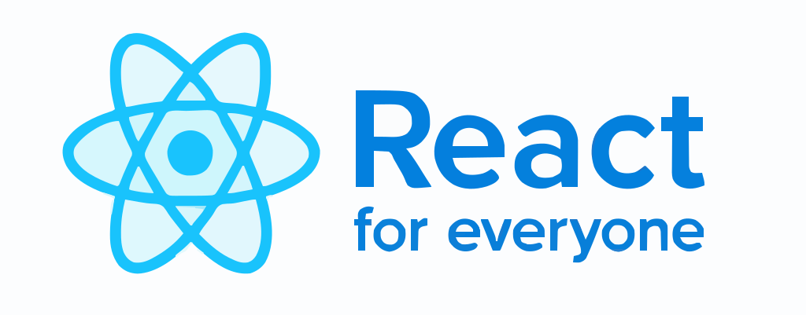

<p align="center">
  
</p>

<p align="center">
  
  
  
  
</p>

<h2 align="center">
 A complete beginner-to-advanced guide to learning React, covering everything from
 fundamentals to advanced topics like Next.js, React Suspense, and Server Components.
</h2>

---

## 📑 Table of Contents

- [📑 Table of Contents](#-table-of-contents)
- [📂 Repository Structure](#-repository-structure)
- [⚙️ Setup Instructions](#️-setup-instructions)
- [🤿 Dive Into Sections](#-dive-into-sections)
- [📌 Roadmap](#-roadmap)
- [🙌 Contributing](#-contributing)
- [📄 License](#-license)
- [💬 Feedback](#-feedback)

---

## 📂 Repository Structure  

This repository is organized into **sections** for each React concept:

| Section | Description |
|---------|-------------|
| [**01_react_what_and_why** ⚛️](./01-react-what-and-why/) | Introduction to React, DOM Manipulation, SPAs, and project setup. |
| [**02_react_components_jsx** 🧩](./02-react-components-jsx/) | Components, JSX, dynamic content, and best practices. |
| [**03_components_props** 📨](./03-components-props/) | Passing props, children prop, and prop drilling solutions. |
| [**04_events_state** 🎛️](./04-events-state/) | Event handling, useState hook, and two-way data binding. |
| [**05_lists_conditionals** 📋](./05-lists-conditionals/) | Conditional rendering, list mapping, and keys in React. |
| [**06_styling_react_apps** 🎨](./06-styling-react-apps/) | Styling with CSS Modules, Tailwind, and styled-components. |
| [**07_portals_refs** 🔗](./07-portals-refs/) | React Portals, Refs vs State, controlled/uncontrolled components. |
| [**08_side_effects** 🌊](./08-side-effects/) | Side effects with useEffect, cleanup functions, async code. |
| [**09_user_input_forms** 📝](./09-user-input-forms/) | Handling forms, actions, and optimistic updates. |
| [**10_react_optimization** ⚡](./10-react-optimization/) | Virtual DOM, lazy loading, and performance optimization. |
| [**11_complex_state** 🏗️](./11-complex-state/) | Context API, useReducer, multi-component state handling. |
| [**12_custom_hooks** 🪝](./12-custom-hooks/) | Building reusable custom hooks for cleaner code. |
| [**13_multipage_apps_router** 🛣️](./13-multipage-apps-router/) | React Router, dynamic routes, and navigation. |
| [**14_data_with_router** 📡](./14-data-with-router/) | Data fetching, loaders, and submission handling. |
| [**15_ssr_nextjs** 🌐](./15-ssr-nextjs/) | Server-side rendering and fullstack development with Next.js. |
| [**16_react_server_components** 🖥️](./16-react-server-components/) | React Server Components and Server Actions concepts. |
| [**17_react_suspense_use_hook** ⏳](./17-react-suspense-use-hook/) | React Suspense and the `use()` hook for data fetching. |
| [**18_further_resources** 📖](./18-further-resources\)/) | Advanced projects, libraries, and further learning paths. |

---

## ⚙️ Setup Instructions  

Clone and run the project in a few easy steps:

```bash
# Clone this repository
git clone https://github.com/HashimThePassionate/react-for-everyone.git

# Navigate to the folder
cd react-for-everyone

# Install dependencies
npm install

# Start the development server
npm start
````

---

## 🤿 Dive Into Sections

Each section contains:

* ✅ Topic-wise folders with examples
* ✅ React components & code snippets
* ✅ Real-world projects and activities
* ✅ Practice exercises and challenges

---

## 📌 Roadmap

* [x] React Fundamentals
* [x] Components and Props
* [ ] State & Events (WIP)
* [ ] React Router (WIP)
* [ ] Advanced React (Next.js, RSC, Suspense) (WIP)

💡 *Stay tuned for daily updates as more sections get completed!*

---

## 🙌 Contributing

We ❤️ contributions! Follow these steps to get started:

```bash
# 1. Fork the repository
# 2. Create a feature branch
git checkout -b feature/awesome-feature

# 3. Commit your changes
git commit -m "Add awesome feature"

# 4. Push to the branch
git push origin feature/awesome-feature
```

Then open a **Pull Request** 🚀

---

## 📄 License

This project is licensed under the [MIT License](./LICENSE).

---

## 💬 Feedback

Found a bug or have suggestions?

* ➡️ [Open an issue](https://github.com/HashimThePassionate/react-for-everyone/issues)
* ➡️ Use GitHub Discussions for ideas & Q&A

---

<div align="center">
<i>⭐ Star this repository to stay updated with new React tutorials and examples!</i>
</div>

